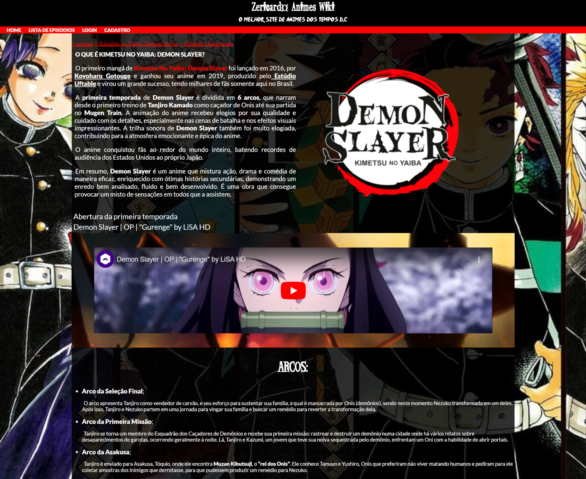

<h1 style = "text-align: center">Site ZeRicardo AnimesWiki - Demon Slayer</h1>

</img>

 
Projeto original desenvolvido com meus primeiros conhecimentos em HTML e CSS adquiridos durante o curso de HTML5 e CSS3 do Curso em Vídeo

 <h2>Tecnologias</h2>
 <ul>
    <li>HTML5
    <li>CSS3
 </ul>

O site ZeRicardo Animes Wiki - Demon Slayer apresenta uma descrição simples sobre o anime e algumas fotos do personagem, nas quais usei o efeito Parallax. Inicialmente, ele deveria conter áudios com a voz dos personagens, mas foram removidas posteriormente.

